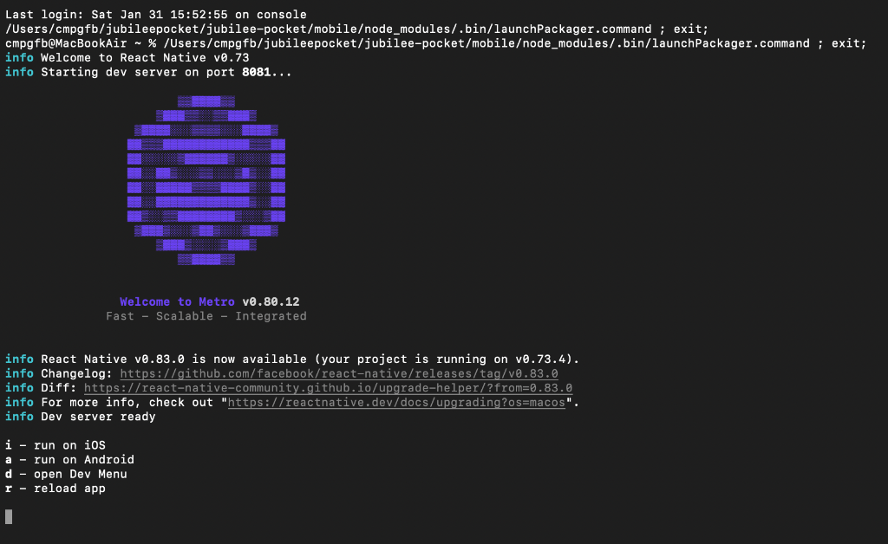
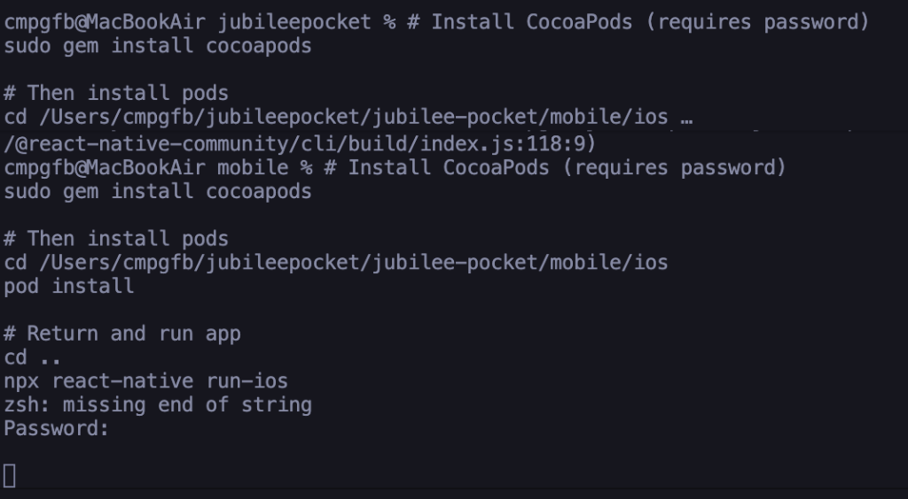

# Jubilee Pocket 📱

> **Jubilee Pocket turns your Solana Seeker into a device that pays for itself. Stake SKR tokens directly to Guardians via the Seed Vault to unlock instant, self-repaying jUSDi credit. Secure, biometric, and built for the Liberty Layer**

[](https://opensource.org/licenses/MIT)
[](https://solana.com)
[](https://www.anchor-lang.com/)

<p align="center">
  
</p>

---

## App Screenshots

<p align="center">
  
  &nbsp;&nbsp;&nbsp;
  
</p>

---

## Overview

Jubilee Pocket is a mobile-first lending protocol designed for the **Solana Seeker** device. Users deposit **Stakehouse Keeper Receipts (SKR)** as collateral and borrow **jUSDi** (Jubilee USD Index) against their holdings with up to **55% LTV** — plus a holder bonus for larger positions.

### Key Features

- 🏦 **Collateralized Lending** — Deposit SKR, borrow jUSDi
- 📈 **Yield Harvesting** — Automatically repays debt with staking rewards
- 🔐 **Seed Vault Integration** — Native hardware security on Seeker
- ⚡ **Pyth Oracle** — Real-time price feeds for accurate LTV
- 🔄 **Jupiter Swaps** — Swap jUSDi ↔ USDC directly in-app
- 🛑 **Emergency Pause** — Circuit breaker for admin control
- 📱 **React Native App** — Mobile-first experience

---

## Program Addresses

### Devnet (Live ✅)
| Program | Address |
| :--- | :--- |
| Guardian Vault | `DwuGR9qYkgYUPxR6jZSkAHdv23YPeqaAwxLAG593L1ar` |
| SKR Mint (Demo) | `SKR1111111111111111111111111111111111111111` |
| jUSDi Mint (Demo) | `jUSD111111111111111111111111111111111111111` |

> **Note**: Demo mints are used for testing. Production mints will be deployed with mainnet launch.

---

## Repository Structure

```
jubilee-pocket/
├── programs/
│   └── guardian-vault/     # Anchor program
│       └── src/
│           ├── instructions/
│           ├── state/
│           └── errors.rs
├── mobile/                  # React Native app
├── assets/                  # Logo and screenshots
├── tests/                   # Integration tests
├── docs/
│   ├── AUDIT_REPORT.md
│   ├── RED_TEAM_AUDIT.md
│   ├── ONE_PAGER.md
│   ├── COPYRIGHT.md
│   └── PRIVACY_POLICY.md
├── hackathon/
│   └── apk/                 # Android APK for submission
└── Anchor.toml
```

---

## Quick Start

### Prerequisites
- Rust 1.70+
- Solana CLI 1.16+
- Anchor 0.28.0
- Node.js 18+

### Build & Test

```bash
# Clone
git clone git@github.com:Jubilee-Protocol/jubilee-pocket.git
cd jubilee-pocket

# Install dependencies
yarn install

# Build program
anchor build

# Run tests
anchor test
```

### Deploy to Devnet

```bash
# Configure for devnet
solana config set --url devnet

# Get devnet SOL
solana airdrop 5

# Deploy
anchor deploy --provider.cluster devnet
```

---

## How It Works

### Deposit & Borrow Flow
1. User deposits SKR collateral
2. Pyth oracle provides real-time price
3. System calculates max borrow (55% LTV base)
4. jUSDi minted to user wallet

### Harvest & Repay
1. User calls `harvest_repay` instruction
2. Rewards calculated from staking APY
3. Debt reduced by reward amount (minus 3% fee)

### Withdrawal Flow (Two-Step)
1. **Start Cooldown** — User initiates withdrawal
2. **Wait 48 Hours** — Security cooldown
3. **Complete** — Collateral returned, account closed

---

## Security

| Audit | Score | Status |
| :--- | :---: | :---: |
| Internal Review | 93/100 | ✅ Complete |

See [AUDIT_REPORT.md](./docs/AUDIT_REPORT.md) for details.

---

## Roadmap

- [x] Core program development
- [x] Security audit (93/100)
- [x] Pyth oracle integration
- [x] Devnet deployment
- [x] Mobile app integration (Jubilee Pocket)
  - [x] React Native with MWA support
  - [x] SwapScreen (Jupiter API)
  - [x] Push notifications
  - [x] Demo mode for testing
- [ ] Mainnet launch (February 2026)
- [ ] Orca pool creation (jUSDi/USDC)

---

## Built By

**Jubilee Labs** — Building the Liberty Layer known as Jubilee Protocol 

- [Website](https://jubileepocket.xyz)
- [Twitter](https://twitter.com/JubileeProtocol)
- [Telegram](https://t.me/JubileeProtocol)

---

## License

MIT License — see [LICENSE](./LICENSE)

---

*"The prudent see danger and take refuge, but the simple keep going and pay the penalty."* — Proverbs 22:3
