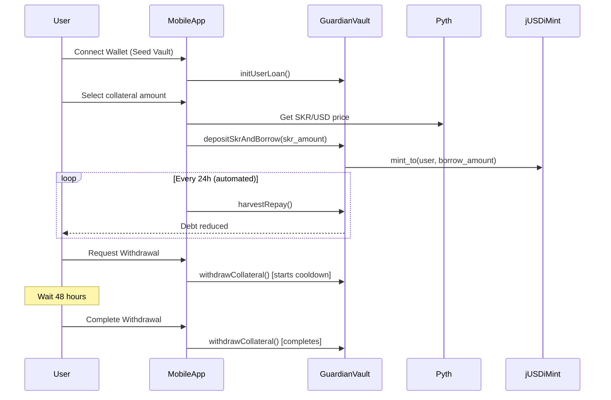

# Guardian Vault Integration Guide

## User Flow Overview



---

## Integration with jSOLi & jUSDi

### jSOLi (Collateral - Mock SKR)
For the hackathon, we use Mock SKR instead of real jSOLi. On Mainnet:

1. **Replace Mock SKR with jSOLi**:
   - Update `mock_skr_mint` to jSOLi mint address
   - jSOLi Mainnet: *TBD* (Use Devnet address for testing)

2. **Price Oracle**:
   - Create Pyth price feed for jSOLi/USD
   - Or use underlying LST prices + jSOLi exchange rate

### jUSDi (Debt Token)
jUSDi is minted when users borrow. The vault must be the **mint authority**.

1. **Devnet jUSDi Mint**: `2HJod3PNRNfYzzgZHVM5TjCoZrFGJjPmYkRkUeJMKw9o`
2. **Setup Steps**:
   ```bash
   # 1. Deploy program to Devnet
   anchor deploy --provider.cluster devnet
   
   # 2. Transfer mint authority to vault PDA
   spl-token authorize <JUSDI_MINT> mint <VAULT_PDA>
   
   # 3. Verify
   spl-token display <JUSDI_MINT>
   ```

---

## Mobile App Integration

### Prerequisites
- React Native 0.73+
- Solana Mobile Stack (MWA)
- @coral-xyz/anchor

### Key Files to Create

#### 1. `services/GuardianVaultService.ts`
```typescript
import { Program, AnchorProvider } from '@coral-xyz/anchor';
import { IDL, GuardianVault } from '../idl/guardian_vault';

export class GuardianVaultService {
  program: Program<GuardianVault>;
  
  constructor(provider: AnchorProvider) {
    this.program = new Program(IDL, PROGRAM_ID, provider);
  }
  
  async initUserLoan(userPubkey: PublicKey) {
    const [userLoanPda] = PublicKey.findProgramAddressSync(
      [Buffer.from("user_loan"), userPubkey.toBuffer()],
      PROGRAM_ID
    );
    
    return this.program.methods.initUserLoan()
      .accounts({
        user: userPubkey,
        userLoan: userLoanPda,
        systemProgram: SystemProgram.programId,
      })
      .transaction();
  }
  
  async deposit(userPubkey: PublicKey, amount: BN) {
    // ... build transaction
  }
}
```

#### 2. `screens/BorrowScreen.tsx`
```tsx
const handleBorrow = async () => {
  const tx = await vaultService.deposit(wallet.publicKey, new BN(amount));
  await signAndSendTransaction(tx);
};
```

---

## Local Testing

### 1. Start Local Validator
```bash
# Terminal 1
solana-test-validator --reset
```

### 2. Build and Deploy
```bash
# Terminal 2
cd jubilee-pocket
cargo build-sbf
anchor deploy

# Note the Program ID
```

### 3. Run Anchor Tests
```bash
anchor test --skip-local-validator --skip-build
```

### 4. Manual Testing (CLI)
```bash
# Initialize vault
anchor run initialize

# Mint test SKR
anchor run mint-skr -- --amount 1000

# Deposit and borrow
anchor run deposit -- --amount 100
```

---

## Devnet Deployment Cost Breakdown

| Component | Cost (SOL) | Notes |
| :--- | ---: | :--- |
| Program Deployment | ~3.0 | ~150KB binary |
| VaultState Account | ~0.002 | 200 bytes |
| GuardianList Account | ~0.003 | ~500 bytes |
| Mock SKR Mint | ~0.002 | If creating new |
| 100 Test Transactions | ~0.05 | At 5000 lamports/tx |
| **Total Estimate** | **~3.5 SOL** | Request from faucet |

### Faucet
```bash
solana airdrop 5 --url devnet
```

---

## Checklist Before Devnet

- [ ] Fix all CRITICAL audit findings
- [ ] Fix all HIGH audit findings
- [ ] Integrate Pyth SDK (remove hardcoded prices)
- [ ] Add pause checks to all instructions
- [ ] Add signer validation to harvest
- [ ] Remove `close = user` from withdraw
- [ ] Test full loan lifecycle
- [ ] Deploy with Squads multisig authority

---

## API Reference

| Instruction | Description | Accounts |
| :--- | :--- | :--- |
| `initialize` | Create vault config | authority, vault_state, labs_treasury |
| `init_user_loan` | Create user's loan PDA | user, user_loan |
| `deposit_skr_and_borrow` | Deposit collateral, mint jUSDi | user, vault_state, user_loan, ATAs, mints |
| `harvest_repay` | Claim rewards, reduce debt | user_loan, vault_state, treasury |
| `withdraw_collateral` | Initiate/complete withdrawal | user, user_loan, vault_state, ATAs |
| `liquidate_loan` | Seize underwater position | liquidator, user_loan, vault_state, ATAs |
